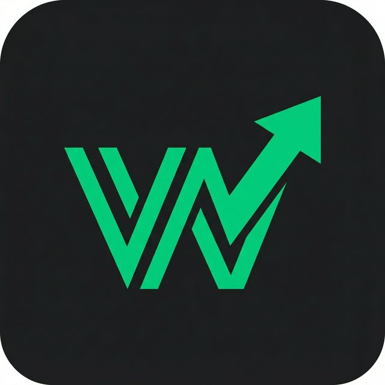

# WealthFlow | The Sovereign Ledger

WealthFlow is a robust, production-ready web application designed for comprehensive personal finance tracking combined with a specialized betting/risk tracker. It relies on a strictly-enforced double-entry ledger database ensuring money moving across your portfolios remains 100% accurate.

<p align="center">
  
</p>

## 🚀 Key Features
- **Dashboard & Net Worth Tracking**: Get a holistic view of your entire aggregated "Sovereign Ledger" sum dynamically calculated from diverse portfolio accounts.
- **Transactions Database**: Double-entry bookkeeping system handling direct standard expense/income ledgers with peer transfers.
- **Savings Goals**: Enforce "Locked" buckets where money stays preserved alongside a progressive financial goal indicator.
- **Betting/Risk Logging**: Specifically isolates betting history mapping exact Matches, Bookmakers, Odds, and Stakes while auto-computing winnings routing back into the 'Risk' active portfolio bankroll.
- **Authentication**: Fully managed login workflows utilizing backend-protected middleware logic so only authenticated members have data footprint access.

## 🧱 Tech Stack
- **Next.js 14 (App Router)**: The underlying React framework serving optimal SSR rendering architecture.
- **Supabase**: Open-source Firebase alternative heavily leveraged for Database Models (PostgreSQL) and Auth logic.
- **Tailwind CSS**: Strict styling structure implementing a rich "dark mode" native design system out of the box with `Material Symbols`.

## 🛠 Getting Started

### Prerequisites
You need a [Supabase.com](https://supabase.com) project instantiated and locally have `Node.js` installed.

### 1. Database Setup
Once your Supabase instance is deployed:
1. Copy the exact contents of `supabase/schema.sql`.
2. Navigate into your Supabase Dashboard -> **SQL Editor**.
3. Paste the queries and click **Run**. This will create the base relational tables (Users, Accounts, Transactions, Bets, Savings Logs), attach secure Row-Level Security contexts to them, and provision the triggers to autogenerate Default bank buckets for any user who registers directly.

### 2. Environment Variables
Duplicate `.env.example` (or create a new `.env.local` directly at the root of the project folder) and insert the configurations pulled exactly from your Supabase Dashboard -> **Project Settings -> API**.

```env
NEXT_PUBLIC_SUPABASE_URL=https://<your-project-id>.supabase.co
NEXT_PUBLIC_SUPABASE_ANON_KEY=<your-anon-key>
```

### 3. Local Development
Install dependencies via npm:
```bash
npm install
```

Boot the Next.js local server:
```bash
npm run dev
```

Head into `http://localhost:3000/signup`, register a mock user natively, and start logging!

## 📜 License
Distributed under the MIT License. WealthFlow is a private tool built strictly for independent financial independence strategies.
